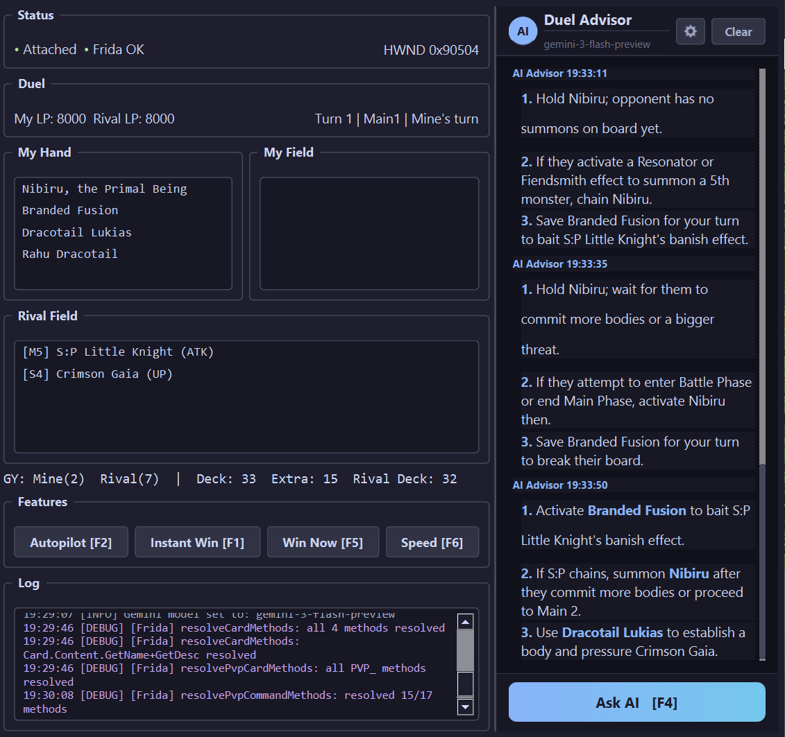

# Master Duel Autoly

Bot for Yu-Gi-Oh! Master Duel. Hooks into the game via Frida + IL2CPP. Works on Solo and PvP.




## Features

- **AI Advisor** - asks Gemini what to do based on your hand, field, GY, and available commands. just press F4 mid-duel
- **Instant Win** - sets rival LP to 0. F1 keeps it on every turn, F5 does it once
- **Autopilot** - makes the game's built-in AI play for you (Solo only)
- **Speed Hack** - runs the game at 3x speed so you don't fall asleep during animations

## Setup

Need Python 3.10+, Windows 10/11, Master Duel on Steam.

```
pip install -r requirements.txt
python main.py
```

The bot waits for the game automatically, so launch order doesn't matter.

For AI advisor, get a free key from [Google AI Studio](https://aistudio.google.com/apikey) and either put it in a `.env` file (`GEMINI_API_KEY=your_key`) or paste it in the settings dialog (gear icon).

## Hotkeys

F1 instant win (toggle), F2 autopilot, F4 ask AI, F5 instant win (once), F6 speed hack, F12 quit.

## Build

To make a standalone exe, run `build.bat` or:

```
pyinstaller masterduel_autoly.spec --noconfirm
```

Output goes to `dist/MasterDuelAutoly/`.

## Disclaimer

For educational and personal use only. Use at your own risk.
